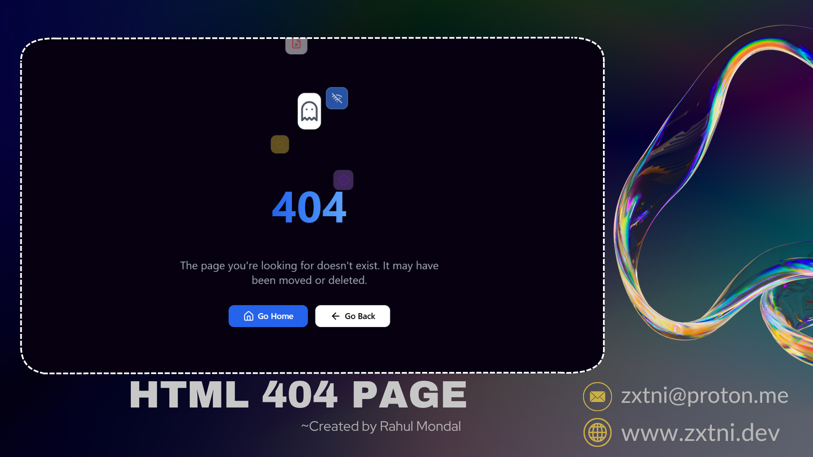

## Ghost404

Clean, lightweight 404 page with subtle animations ✨👻 Built with Tailwind CSS + Lucide. Drop-in fallback for any site, easy to customize.

 **Live Demo:** [www.zxtni.app/404/](https://www.zxtni.app/404/)

 **About**
Clean, animated 404 page built with Tailwind CSS and Lucide icons. Drop it into any static site or route fallback.

 **Quick Start**
- Open `404.html` in your browser or serve it from your web server as the 404 fallback.

 **Tech**
- **Tailwind CSS** via CDN
- **Lucide** icons via CDN

### Links
 **GitHub:** [github.com/zxtni](https://github.com/zxtni)  

 **Instagram:** [@igofrahul](https://www.instagram.com/igofrahul) 

 **Telegram:** [@zxtni](https://t.me/zxtni)

 **License**

Released under the MIT License. You can use, modify, and distribute it with attribution.

 **Thank you**

Thanks for checking out Ghost404! If it helped, consider dropping a star on GitHub. 🙌

